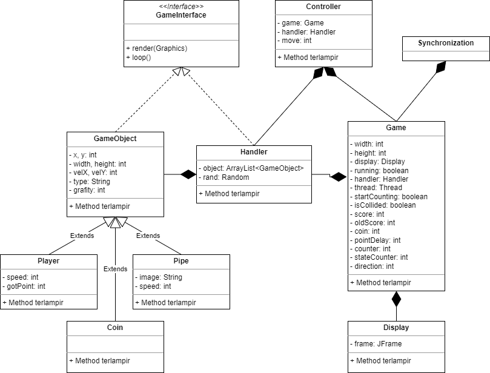

# **LP7C2DPBO2023**
Sesuai dengan soal latihan [**Modul 7**](https://docs.google.com/document/d/1P8V9BdTXqdjToJBzjmeKXMqFi6mfpaFzVSQgIvZfatE/edit)

---
- -
Saya Muhammad Fadhillah Nursyawal NIM 2107135 mengerjakan soal LP 7 dalam mata kuliah Desain Pemrograman Berorientasi Objek 
untuk keberkahanNya maka saya tidak melakukan kecurangan seperti yang telah dispesifikasikan. Aamiin.

## **Desain Program**
Desain program sudah dibuat oleh author dan saya hanya menambahkan kelas sebagai object game mengikuti design yaitu pada kelas `Pipe` dan `Coin`.

**Class Diagram**

Sesuai dengan gambar Class Diagram jadi design nya ini dimulai dari Synchronization namun kelas utamanya yaitu Game. 

`Synchronization` ini punya kelas game karna untuk menjalankan game nya. 

`Game` ini punya `Display` untuk menampilkan JFrame ke layar. Game juga punya handler sebagai perantara antara Game object yang akan dimasukan pada JFrame nya ini, karna itu codenya ada di game. 

`Handler` ini punya kumpulan game object sehingga dia composite pada game object

pada `GameObject` ini punya anak seperti `Player`, `Coin`, dan `Pipe`. ini merupakan inheritance karna kelas-kelas tersebut sebagai game object yang akan dimasukan ke kelas Game. 

`GameInterface` merupakan interface dari game object dan Handler. 

terakhir kelas `Controller` ini seperti perantara antara keyboard dan Game nya untuk mengkontrol Game object nya.

#### **Object Game**
- Player (Burung) -> diam, dapat dikontrol dengan controller / keyboard.
- Coin (Logo UPI) -> Dirender secara `random`, ketika didapatkan oleh player (collision) maka akan berpindah secara random.
- Pipe (Pipa) -> Pipe `atas` dan `bawah`, dirender dengan ukuran `tinggi yang random` dan disesuaikan jaraknya antara pipe atas dan bawah agar tidak bertabrakan, keduanya dimasukan dengan `waktu looping` yang sudah ditentukan dan akan `selalu bergerak kekiri` sebagai rintangan player. 

#### **Controller**
- [`W`] / [`up`] -> untuk bergerak `keatas`
- [`S`] / [`down`] -> untuk bergerak `kebawah`
- [`D`] / [`right`] -> untuk bergerak `kekanan`
- [`A`] / [`left`] -> untuk bergerak `kekiri` 

## **Penjelasan Alur**

Tujuan program game ini untuk mengumpulkan score sebanyak-banyaknya dan menghindari pipe/collision karena akan mengurangi score.

Saat program diijalankan sistem akan menampilkan frame pada layar. lalu frame akan menampilkan background dengan tulisan score dan coin yang didapatkan, sekaligus menampilkan object `player` (burung) dan `coin` (Logo UPI). Setiap waktu, sistem akan menambahkan object `pipa` (pipe) pada frame yang setiap waktunya akan bergerak terus kekiri sebagai rintangan player.

Player dapat berpindah `keatas`, `kebawah`, `kekiri`, dan `kekanan`.  
Kita dapat menggerakan player dengan [**Controller**](#controller)  
player dapat mendapatkan point dengan [**Score**](#score)

#### **Score**
- control key `keatas` / `kebawah` / `kekanan` / `kekiri` -> `+1` point (sesuai dengan spesifikasi tugas)
- mendapatkan `coin` -> `+5` point
- collision dengan `pipe` = `-1` point (tiap terkena pipa)

setelah coin didapatkan maka koin akan berpindah secara random sesuai dengan spesifikasi bonus tugas

## **Dokumentasi Execute Program**

